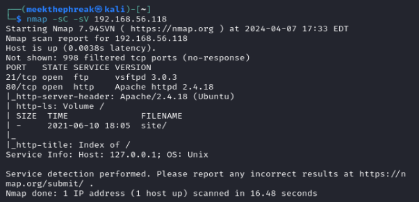

# Jangow: 1.0.1 Walkthrough

## Author Information

- **Name:** Mikhail Wilson
- **GitHub:** <https://github.com/meekthephreak>
- **Twitter:** <https://twitter.com/meekthephreak>
- **LinkedIn:** <https://www.linkedin.com/in/mikhail-wilson-05a45a51/>
- **Website:** <https://www.thecyberphreak.com>

## TL;DR Summary

- Retrieved user.txt and proof.txt (root flag) on the jangow 1.0.1 box.
- Key vulnerabilities exploited:
  - Insecure FTP server
  - Vulnerable Apache Web Server
  - Old Kernel Version (4.4.0-31-generic)

- Tools and techniques used:
  - Nmap
  - Gobuster
  - Searchsploit
  - ExploitDB
  - LinPEAS

- Major Findings:
  - Web server allowed for browser code execution within an unsecure URL parameter
  - Exposed credentials in config.php
  - Unsecure FTP server
  - Old kernel version led to Privilege Escalation

- Recommendations:
  - Avoid using FTP; use SFTP instead
  - Disable anonymous user file upload/retrieval (vsfptd.config file)
  - Keep kernel updated to the latest version

## Introduction

- **Box Name:** Jangow 1.0.1
- **Platform:** VulnHub
- **Difficulty:** Beginner
- **Objectives:** Capture the user and root flags
- **Tools Used:** Nmap, Gobuster, Searchsploit, ExploitDB, LinPEAS

## Pre-Engagement

### Scope Definition

- **Scope:**
  - Target: Jangow01 Virtual Machine
  - Local Environment Only

### Rules of Engagement

- **ROE:**
  - No Network Activity (*Keep it in the sandbox*)
  - Hack Responsibly! 😊

## Reconaissance

### Active Recon

- **Host Discovery:**
We are provided with the IP address `192.168.56.118`


- **Port Scanning:**
Using Nmap, we scan for active ports on the host.

```bash
nmap -sV -sC 192.168.56.118
```



We found ports `80` and `21`.

- **Service Enumeration:**
  - vsftpd 3.0.3
  - Apache httpd 2.4.18

We can try to exploit these later!
