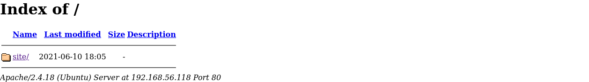
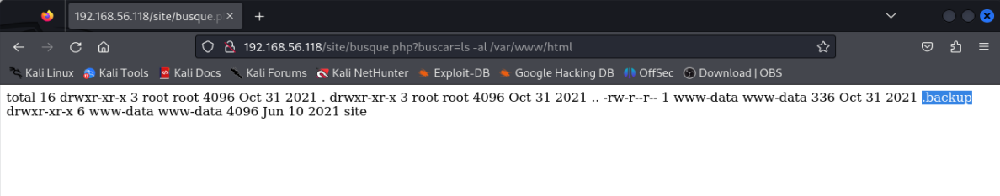

# Jangow: 1.0.1 Walkthrough

## Author Information

- **Name:** Mikhail Wilson
- **GitHub:** <https://github.com/meekthephreak>
- **Twitter:** <https://twitter.com/meekthephreak>
- **LinkedIn:** <https://www.linkedin.com/in/mikhail-wilson-05a45a51/>
- **Website:** <https://www.thecyberphreak.com>

## TL;DR Summary

- Retrieved user.txt and proof.txt (root flag) on the jangow 1.0.1 box.
- Key vulnerabilities exploited:
  - Insecure FTP server
  - Vulnerable Apache Web Server
  - Old Kernel Version (4.4.0-31-generic)

- Tools and techniques used:
  - Nmap
  - Gobuster
  - Searchsploit
  - ExploitDB
  - LinPEAS

- Major Findings:
  - Web server allowed for browser code execution within an unsecure URL parameter
  - Exposed credentials in config.php
  - Unsecure FTP server
  - Old kernel version led to Privilege Escalation

- Recommendations:
  - Avoid using FTP; use SFTP instead
  - Disable anonymous user file upload/retrieval (vsfptd.config file)
  - Keep kernel updated to the latest version

## Introduction

- **Box Name:** Jangow 1.0.1
- **Platform:** VulnHub
- **Difficulty:** Beginner
- **Objectives:** Capture the user and root flags
- **Tools Used:** Nmap, Gobuster, Searchsploit, ExploitDB, LinPEAS

## Pre-Engagement

### Scope Definition

- **Scope:**
  - Target: Jangow01 Virtual Machine
  - Local Environment Only

### Rules of Engagement

- **ROE:**
  - No Network Activity (*Keep it in the sandbox*)
  - Hack Responsibly! 😊

## Reconaissance

### Active Recon

- **Host Discovery:**
We are provided with the IP address `192.168.56.118`


- **Port Scanning:**
Using `Nmap`, we scan for active ports on the host.

```bash
nmap -sV -sC 192.168.56.118
```


We found ports `80` and `21`.

- **Service Enumeration:**
  - vsftpd 3.0.3
  - Apache httpd 2.4.18

We can try to exploit these later!

## Vulnerability Analysis

First, we startup `Gobuster` to start directory bruteforcing on the web server, using a built-in wordlist.

```bash
gobuster dir -u 192.168.56.118 -w /usr/share/wordlists/dirbuster/directory-list-2.3-medium.txt
```

While that's running, we can open `http://192.168.56.118` in the browser.



Lets click on the `site/` link to see what we find.


We find a webpage with links at the top to explore. `Buscar` looks interesting...

## Exploitation


It seems to be an empty webpage, but lets see if the `buscar=` parameter is vulnerable.


Boom! Typing `pwd` into the URL gives us output. We have code execution! Now lets see if we can list the directory contents.


It works let's explore further.



After looking around for a bit, we found an interesting file named `.backup`.


We found credentials inside of the file, let's see if they work for the ftp server.


We successfully logged in using username `jangow01` and password `abygurl69`. Let's first look in the `/home` directory.


We found the flag `user.txt` and moved it to our local machine using `get user.txt`.

Next, lets try to login to the machine using the same leaked credentials we found earlier.


Success! Now we can begin the Post-Exploitation phase.

## Post Exploitation

-**Privilege Escalation**

Next, lets try using LinPeas to find likely attack vectors to escalate our privileges.


Using FTP we upload the file to the `/home/jangow01` directory with the command `put linpeas.sh`.

Next, we make the file executable and send the output to a log file for further analysis.

```bash
jangow01@jangow01:~$ chmod + x linpeas.sh
jangow01@jangow01:~$ ./linpeas.sh >> linpeas.log
```


The kernel version `4.4.0.31-generic` seems vulnerable. Lets look into this further.


Download the exploit,transfer via FTP and see if it works to gain root access.


We've gained root access, time to find the flag!


Root Flag!
